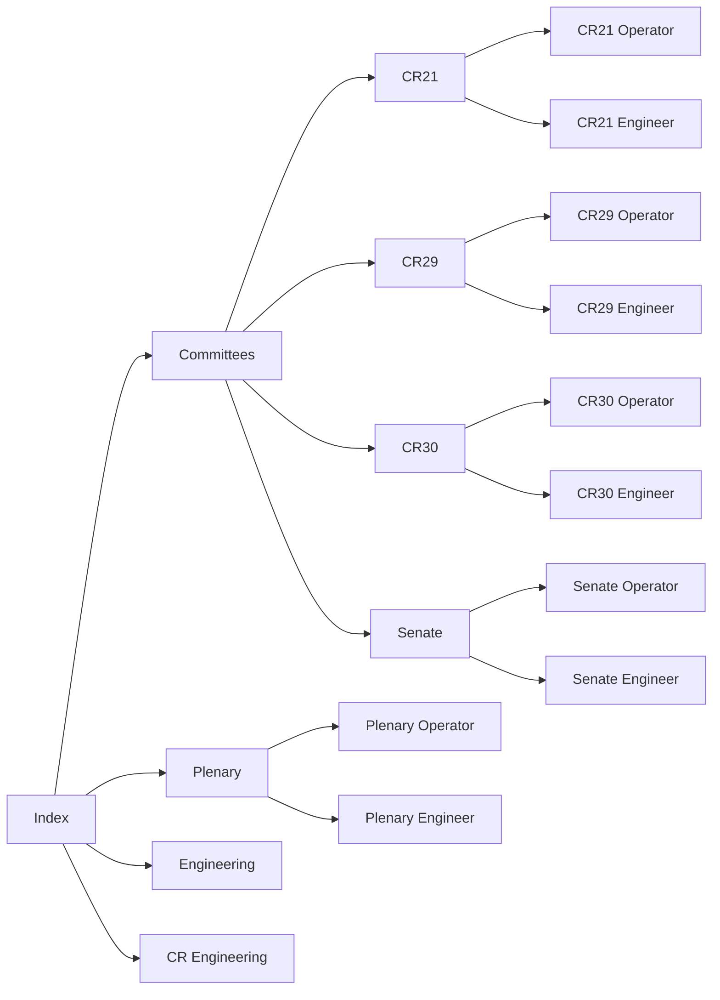

# Site Structure Implementation Plan

## Overview

This plan implements the site structure defined in `pages.md` as a functional web application, creating a hierarchical navigation system that matches the Mermaid flow diagram and organizes all engineering systems by committee room and role.

## Creative Phase Summary ✅ COMPLETED

**Architecture Decisions Made:**

- **Navigation Approach**: Multi-page with separate HTML files for each page
- **Navigation Flow**: Step-by-step (Index → Committees → Room → Role)
- **Role Selection**: Large, color-coded buttons with icons for quick recognition
- **Data Source**: Use `pages.md` as primary source, abandon `bookmarks.md`
- **Content Strategy**: Manual HTML creation for simplicity and speed
- **Visual Design**: Category-based color coding, desktop-optimized layout
- **Navigation**: Breadcrumb navigation with clickable path elements

**Key Design Principles:**

- Functionality over aesthetics
- Quick access in critical situations
- Large, clearly marked buttons
- Color coding for quick visual identification
- Desktop/engineering workstation optimization

## Site Structure Analysis

Based on `pages.md`, the site follows this hierarchy:



## Implementation Strategy

### Phase 1: Core Architecture

**1.1 Multi-Page Application Setup** ✅ COMPLETED

- Implement separate HTML files for each page
- Create page templates for each navigation level
- Set up local file loading mechanism
- Maintain offline functionality

**1.2 Data Structure Design** ✅ COMPLETED

- Use `pages.md` as primary data source
- Manual HTML creation for simplicity and speed
- Design efficient file organization structure
- Abandon `bookmarks.md` (no longer relevant)

**1.3 Navigation Framework** ✅ COMPLETED

- Create hierarchical navigation with breadcrumbs
- Implement step-by-step navigation flow
- Add large, color-coded role selection buttons
- Design desktop-optimized navigation (no mobile needed)

### Phase 2: Page Implementation

**2.1 Index Page**

- Main landing page with navigation to all sections
- Quick access to most frequently used systems
- Search functionality
- Status indicators for critical systems

**2.2 Plenary Section**

- Plenary main page with links to Operator/Engineer roles
- Plenary Operator page with camera controls and essential links
- Plenary Engineer page with full system access including spotter cameras

**2.3 Committees Section**

- Committee room selection interface
- Individual pages for CR21, CR29, CR30, Senate
- Each room page with Operator/Engineer role selection

**2.4 Role-Based Pages**

- Operator pages: Essential links, camera controls, basic systems
- Engineer pages: Full system access, advanced controls, diagnostic tools
- Consistent layout across all committee rooms

**2.5 Engineering Section**

- General engineering tools and documentation
- KVM switch access
- Network infrastructure management
- Support systems and documentation

### Phase 3: Content Integration

**3.1 Bookmark Mapping**

- Map existing bookmarks to appropriate committee room pages
- Categorize systems by function and priority
- Create role-specific filtered views
- Maintain search functionality within new structure

**3.2 System Organization**

- Group systems by committee room (CR21, CR29, CR30, Senate)
- Organize by role (Operator vs Engineer)
- Prioritize critical systems for quick access
- Add visual indicators for system types

### Phase 4: User Experience Enhancement

**4.1 Responsive Design**

- Mobile-first approach for all pages
- Touch-friendly navigation for tablets
- Desktop optimization for engineering workstations
- Consistent experience across devices

**4.2 Performance Optimization**

- Lazy loading for page content
- Efficient data caching
- Minimal JavaScript footprint
- Fast page transitions

**4.3 Accessibility**

- Keyboard navigation support
- Screen reader compatibility
- High contrast mode support
- Clear visual hierarchy

## Technical Architecture

### File Structure

```
pages/
├── index.html (main landing page)
├── plenary/
│   ├── index.html
│   ├── operator.html
│   └── engineer.html
├── committees/
│   ├── index.html
│   ├── cr21/
│   │   ├── index.html
│   │   ├── operator.html
│   │   └── engineer.html
│   ├── cr29/
│   │   ├── index.html
│   │   ├── operator.html
│   │   └── engineer.html
│   ├── cr30/
│   │   ├── index.html
│   │   ├── operator.html
│   │   └── engineer.html
│   └── senate/
│       ├── index.html
│       ├── operator.html
│       └── engineer.html
└── engineering/
    ├── index.html
    ├── kvm.html
    ├── network.html
    └── support.html
```

### JavaScript Architecture

- **Router**: Handle navigation between pages
- **DataManager**: Manage bookmark data and filtering
- **UIManager**: Handle dynamic content updates
- **SearchEngine**: Provide search functionality
- **RoleManager**: Handle role-based content filtering

### CSS Framework

- **Navigation**: Hierarchical menu system
- **Layout**: Grid-based responsive layouts
- **Components**: Reusable UI components
- **Themes**: Role-based visual themes

## Creative Phase Requirements

### 🎨 UI/UX Design Phase

- Design intuitive navigation hierarchy
- Create role-based interface designs
- Design responsive layouts for all screen sizes
- Create visual system for different equipment types
- Design loading states and transitions

### 🏗️ Architecture Design Phase

- Design efficient SPA routing system
- Plan data structure for page hierarchy
- Design component architecture for reusability
- Plan integration strategy with existing bookmark system
- Design caching strategy for performance

### ⚙️ Algorithm Design Phase

- Design efficient content filtering algorithms
- Plan search algorithm optimization
- Design data mapping between bookmarks and pages
- Plan role-based access control logic

## Success Criteria

### Functional Requirements

- [ ] Complete navigation flow from index to any role page
- [ ] All links from `pages.md` work correctly
- [ ] Role-based content filtering functions properly
- [ ] Search works within new page structure
- [ ] Offline functionality maintained

### Performance Requirements

- [ ] Page load times under 2 seconds
- [ ] Smooth navigation transitions
- [ ] Responsive design on all target devices
- [ ] Efficient memory usage

### User Experience Requirements

- [ ] Intuitive navigation for engineering team
- [ ] Clear role differentiation
- [ ] Consistent interface across all pages
- [ ] Accessible design for all users

## Risk Mitigation

### Technical Risks

- **Data Integration Complexity**: Start with simple mapping, iterate
- **Performance Issues**: Implement lazy loading and efficient caching
- **Browser Compatibility**: Test on target browsers early and often

### User Experience Risks

- **Navigation Confusion**: User testing with actual engineering team
- **Role Clarity**: Clear visual indicators and consistent patterns
- **Mobile Usability**: Mobile-first design approach

## Next Steps

1. **Creative Phase**: Begin UI/UX design for navigation hierarchy
2. **Architecture Phase**: Design SPA routing and data structure
3. **Implementation Phase**: Start with core navigation framework
4. **Testing Phase**: Continuous testing with engineering team
5. **Deployment Phase**: Gradual rollout with feedback integration

This plan provides a comprehensive roadmap for implementing the site structure defined in `pages.md` while maintaining the existing functionality and performance characteristics of the current system.
