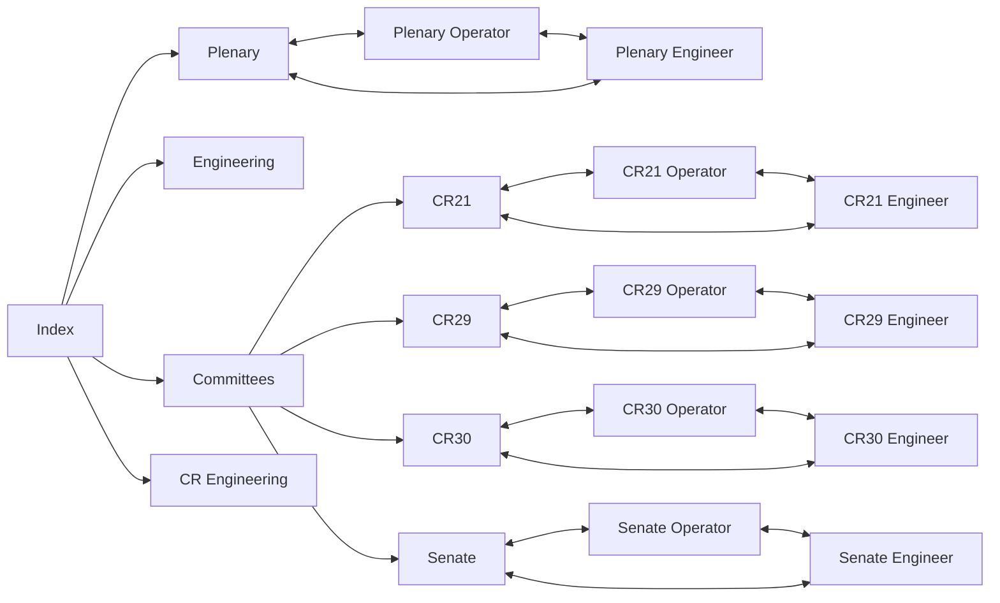

# Pages with Bookmark Links



[Google IP Doc](https://docs.google.com/spreadsheets/d/15e8r2j-wWONs9QBlmVewPKXYqo2VxMaxx85b4Tp8vzk/edit?gid=1082388299#gid=1082388299)

## Committee Rooms

### CR21 Workstation

| Name           | URL                                                                | Notes |
| -------------- | ------------------------------------------------------------------ | ----- |
| Stream iFrame  | selectable                                                         |       |
| CR21 VC Page   | http://10.63.81.187                                                |       |
| Pre-TX Checks  | https://airtable.com/appUpFddJe6ZJsbIl/shr6mD3kEddx52VzF           |       |
| Fault Log      | https://airtable.com/appeQFJ0PxoKwDvR2/shrrVIiTHcVyXXBqq           |       |
| PiComms Home   | https://www.picomms.tv                                             |       |
| NIA Home       | https://www.niassembly.gov.uk                                      |       |
| Business Diary | https://aims.niassembly.gov.uk/assemblybusiness/businessdiary.aspx |       |
| MS Outlook     | https://www.outlook.com                                            |       |
| Wikipedia      | https://www.wikipedia.org                                          |       |
| YouTube        | http://www.youtube.com                                             |       |
| BBC News       | http://www.bbc.co.uk                                               |       |

#### CR21 Operator

| Name           | URL                                                                | Notes |
| -------------- | ------------------------------------------------------------------ | ----- |
| CR21 VC Page   | http://10.63.81.187                                                |       |
| PiComms Home   | https://www.picomms.tv                                             |       |
| NIA Home       | https://www.niassembly.gov.uk                                      |       |
| Business Diary | https://aims.niassembly.gov.uk/assemblybusiness/businessdiary.aspx |       |

| Name     | URL                 | Notes |
| -------- | ------------------- | ----- |
| Camera 1 | http://10.63.82.104 |       |
| Camera 2 | http://10.63.82.105 |       |
| Camera 3 | http://10.63.82.106 |       |
| Camera 4 | http://10.63.82.107 |       |
| Camera 5 | http://10.63.82.108 |       |
| Camera 6 | http://10.63.82.109 |       |

#### CR21 Engineer

| Name          | URL                                                      | Notes |
| ------------- | -------------------------------------------------------- | ----- |
| Camera 1      | http://10.63.82.104                                      |       |
| Camera 2      | http://10.63.82.105                                      |       |
| Camera 3      | http://10.63.82.106                                      |       |
| Camera 4      | http://10.63.82.107                                      |       |
| Camera 5      | http://10.63.82.108                                      |       |
| Camera 6      | http://10.63.82.109                                      |       |
| Room Router   | http://10.63.82.97                                       |       |
| Busby         | http://10.63.81.221:5005                                 |       |
| Vimeo         | http://www.vimeo.com                                     |       |
| CR21 VC Page  | http://10.63.81.187                                      |       |
| Fault Log     | https://airtable.com/appeQFJ0PxoKwDvR2/shrrVIiTHcVyXXBqq |       |
| Google IP Doc |                                                          |       |

### CR29 Workstation

| Name           | URL                                                                | Notes |
| -------------- | ------------------------------------------------------------------ | ----- |
| Stream iFrame  | selectable                                                         |       |
| CR29 VC Page   | http://10.63.81.197                                                |       |
| Pre-TX Checks  | https://airtable.com/appUpFddJe6ZJsbIl/shr6mD3kEddx52VzF           |       |
| Fault Log      | https://airtable.com/appeQFJ0PxoKwDvR2/shrrVIiTHcVyXXBqq           |       |
| PiComms Home   | https://www.picomms.tv                                             |       |
| NIA Home       | https://www.niassembly.gov.uk                                      |       |
| Business Diary | https://aims.niassembly.gov.uk/assemblybusiness/businessdiary.aspx |       |
| MS Outlook     | https://www.outlook.com                                            |       |
| Wikipedia      | https://www.wikipedia.org                                          |       |
| YouTube        | http://www.youtube.com                                             |       |
| BBC News       | http://www.bbc.co.uk                                               |       |

#### CR29 Operator

| Name           | URL                                                                | Notes |
| -------------- | ------------------------------------------------------------------ | ----- |
| CR29 VC Page   | http://10.63.81.197                                                |       |
| PiComms Home   | https://www.picomms.tv                                             |       |
| NIA Home       | https://www.niassembly.gov.uk                                      |       |
| Business Diary | https://aims.niassembly.gov.uk/assemblybusiness/businessdiary.aspx |       |

| Name     | URL                 | Notes |
| -------- | ------------------- | ----- |
| Camera 1 | http://10.63.82.136 |       |
| Camera 2 | http://10.63.82.137 |       |
| Camera 3 | http://10.63.82.138 |       |
| Camera 4 | http://10.63.82.139 |       |
| Camera 5 | http://10.63.82.140 |       |
| Camera 6 | http://10.63.82.141 |       |

#### CR29 Engineer

| Name          | URL                                                      | Notes |
| ------------- | -------------------------------------------------------- | ----- |
| Camera 1      | http://10.63.82.136                                      |       |
| Camera 2      | http://10.63.82.137                                      |       |
| Camera 3      | http://10.63.82.138                                      |       |
| Camera 4      | http://10.63.82.139                                      |       |
| Camera 5      | http://10.63.82.140                                      |       |
| Camera 6      | http://10.63.82.141                                      |       |
| Room Router   | http://10.63.82.97                                       |       |
| Busby         | http://10.63.81.221:5005                                 |       |
| Vimeo         | http://www.vimeo.com                                     |       |
| CR21 VC Page  | http://10.63.81.187                                      |       |
| Fault Log     | https://airtable.com/appeQFJ0PxoKwDvR2/shrrVIiTHcVyXXBqq |       |
| Google IP Doc |                                                          |       |

### CR30 Workstation

| Name           | URL                                                                | Notes |
| -------------- | ------------------------------------------------------------------ | ----- |
| Stream iFrame  | selectable                                                         |       |
| CR29 VC Page   | http://10.63.81.207                                                |       |
| Pre-TX Checks  | https://airtable.com/appUpFddJe6ZJsbIl/shr6mD3kEddx52VzF           |       |
| Fault Log      | https://airtable.com/appeQFJ0PxoKwDvR2/shrrVIiTHcVyXXBqq           |       |
| PiComms Home   | https://www.picomms.tv                                             |       |
| NIA Home       | https://www.niassembly.gov.uk                                      |       |
| Business Diary | https://aims.niassembly.gov.uk/assemblybusiness/businessdiary.aspx |       |
| MS Outlook     | https://www.outlook.com                                            |       |
| Wikipedia      | https://www.wikipedia.org                                          |       |
| YouTube        | http://www.youtube.com                                             |       |
| BBC News       | http://www.bbc.co.uk                                               |       |

#### CR30 Operator

| Name           | URL                                                                | Notes |
| -------------- | ------------------------------------------------------------------ | ----- |
| CR29 VC Page   | http://10.63.81.207                                                |       |
| PiComms Home   | https://www.picomms.tv                                             |       |
| NIA Home       | https://www.niassembly.gov.uk                                      |       |
| Business Diary | https://aims.niassembly.gov.uk/assemblybusiness/businessdiary.aspx |       |

| Name     | URL                 | Notes |
| -------- | ------------------- | ----- |
| Camera 1 | http://10.63.82.168 |       |
| Camera 2 | http://10.63.82.169 |       |
| Camera 3 | http://10.63.82.170 |       |
| Camera 4 | http://10.63.82.171 |       |
| Camera 5 | http://10.63.82.172 |       |
| Camera 6 | http://10.63.82.173 |       |

#### CR30 Engineer

| Name          | URL                                                      | Notes |
| ------------- | -------------------------------------------------------- | ----- |
| Camera 1      | http://10.63.82.168                                      |       |
| Camera 2      | http://10.63.82.169                                      |       |
| Camera 3      | http://10.63.82.170                                      |       |
| Camera 4      | http://10.63.82.171                                      |       |
| Camera 5      | http://10.63.82.172                                      |       |
| Camera 6      | http://10.63.82.173                                      |       |
| Room Router   | http://10.63.82.97                                       |       |
| Busby         | http://10.63.81.221:5005                                 |       |
| Vimeo         | http://www.vimeo.com                                     |       |
| CR21 VC Page  | http://10.63.81.207                                      |       |
| Fault Log     | https://airtable.com/appeQFJ0PxoKwDvR2/shrrVIiTHcVyXXBqq |       |
| Google IP Doc |                                                          |       |

### Senate Workstation

| Name           | URL                                                                | Notes |
| -------------- | ------------------------------------------------------------------ | ----- |
| Stream iFrame  | selectable                                                         |       |
| CR29 VC Page   | http://10.63.81.217                                                |       |
| Pre-TX Checks  | https://airtable.com/appUpFddJe6ZJsbIl/shr6mD3kEddx52VzF           |       |
| Fault Log      | https://airtable.com/appeQFJ0PxoKwDvR2/shrrVIiTHcVyXXBqq           |       |
| PiComms Home   | https://www.picomms.tv                                             |       |
| NIA Home       | https://www.niassembly.gov.uk                                      |       |
| Business Diary | https://aims.niassembly.gov.uk/assemblybusiness/businessdiary.aspx |       |
| MS Outlook     | https://www.outlook.com                                            |       |
| Wikipedia      | https://www.wikipedia.org                                          |       |
| YouTube        | http://www.youtube.com                                             |       |
| BBC News       | http://www.bbc.co.uk                                               |       |

#### Senate Operator

| Name           | URL                                                                | Notes |
| -------------- | ------------------------------------------------------------------ | ----- |
| CR29 VC Page   | http://10.63.81.217                                                |       |
| PiComms Home   | https://www.picomms.tv                                             |       |
| NIA Home       | https://www.niassembly.gov.uk                                      |       |
| Business Diary | https://aims.niassembly.gov.uk/assemblybusiness/businessdiary.aspx |       |

| Name     | URL                 | Notes |
| -------- | ------------------- | ----- |
| Camera 1 | http://10.63.82.200 |       |
| Camera 2 | http://10.63.82.201 |       |
| Camera 3 | http://10.63.82.202 |       |
| Camera 4 | http://10.63.82.203 |       |
| Camera 5 | http://10.63.82.204 |       |
| Camera 6 | http://10.63.82.205 |       |

#### Senate Engineer

| Name          | URL                                                      | Notes |
| ------------- | -------------------------------------------------------- | ----- |
| Camera 1      | http://10.63.82.200                                      |       |
| Camera 2      | http://10.63.82.201                                      |       |
| Camera 3      | http://10.63.82.202                                      |       |
| Camera 4      | http://10.63.82.203                                      |       |
| Camera 5      | http://10.63.82.204                                      |       |
| Camera 6      | http://10.63.82.205                                      |       |
| Room Router   | http://10.63.82.97                                       |       |
| Busby         | http://10.63.81.221:5005                                 |       |
| Vimeo         | http://www.vimeo.com                                     |       |
| CR21 VC Page  | http://10.63.81.217                                      |       |
| Fault Log     | https://airtable.com/appeQFJ0PxoKwDvR2/shrrVIiTHcVyXXBqq |       |
| Google IP Doc |                                                          |       |

## Plenary

| Name           | URL                                                                | Notes |
| -------------- | ------------------------------------------------------------------ | ----- |
| Stream iFrame  | selectable                                                         |       |
| Pre-TX Checks  | https://airtable.com/appDrdU7zmw5i6mYn/shrXF2cXioHCrW2TK           |       |
| Production Log | https://airtable.com/appdVgayk6gK2Kpe8/shrkgCevNU9cuennH           |       |
| Fault Log      | https://airtable.com/appeQFJ0PxoKwDvR2/shrrVIiTHcVyXXBqq           |       |
| Chamber Sound  | http://10.63.81.101/chamberSound_physicalContributorNia            |       |
| PiComms Home   | https://www.picomms.tv                                             |       |
| NIA Home       | https://www.niassembly.gov.uk                                      |       |
| Business Diary | https://aims.niassembly.gov.uk/assemblybusiness/businessdiary.aspx |       |
| MS Outlook     | https://www.outlook.com                                            |       |
| Wikipedia      | https://www.wikipedia.org                                          |       |
| YouTube        | http://www.youtube.com                                             |       |
| BBC News       | http://www.bbc.co.uk                                               |       |

### Plenary Operator

| Name           | URL                                                                | Notes |
| -------------- | ------------------------------------------------------------------ | ----- |
| Chamber Sound  | http://10.63.81.101/chamberSound_physicalContributorNia            |       |
| PiComms Home   | https://www.picomms.tv                                             |       |
| NIA Home       | https://www.niassembly.gov.uk                                      |       |
| Business Diary | https://aims.niassembly.gov.uk/assemblybusiness/businessdiary.aspx |       |

| Name                  | URL                 | Notes |
| --------------------- | ------------------- | ----- |
| Camera 1              | http://10.63.81.121 |       |
| Camera 2              | http://10.63.81.122 |       |
| Camera 3              | http://10.63.81.123 |       |
| Camera 4              | http://10.63.81.124 |       |
| Camera 5              | http://10.63.81.125 |       |
| Camera 6              | http://10.63.81.126 |       |
| Camera 7              | http://10.63.81.127 |       |
| Green Screen Camera 1 | http://10.63.81.231 |       |
| Green Screen Camera 2 | http://10.63.81.231 |       |

### Plenary Engineer

| Name                  | URL                      | Notes |
| --------------------- | ------------------------ | ----- |
| Camera 1              | http://10.63.81.121      |       |
| Camera 2              | http://10.63.81.122      |       |
| Camera 3              | http://10.63.81.123      |       |
| Camera 4              | http://10.63.81.124      |       |
| Camera 5              | http://10.63.81.125      |       |
| Camera 6              | http://10.63.81.126      |       |
| Camera 7              | http://10.63.81.127      |       |
| Green Screen Camera 1 | http://10.63.81.231      |       |
| Green Screen Camera 2 | http://10.63.81.231      |       |
| Spotter Camera 1      | http://10.63.81.131      |       |
| Spotter Camera 2      | http://10.63.81.132      |       |
| Spotter Camera 3      | http://10.63.81.133      |       |
| Spotter Camera 4      | http://10.63.81.134      |       |
| Busby Chamber         | http://10.63.81.101      |       |
| Busby Core            | http://10.63.81.221:5005 |       |

## Engineering

### General

| Name          | URL           | Notes |
| ------------- | ------------- | ----- |
| NIA IP Scheme | Google IP Doc |       |

## KVM

| Name          | URL                                                                  | Notes |
| ------------- | -------------------------------------------------------------------- | ----- |
| AIM Main      | http://10.63.81.10/                                                  |       |
| Aim Reserve   | http://10.63.81.11/                                                  |       |
| Adder Support | https://support.adder.com/tiki/tiki-index.php?page=Product%20Manuals |       |

## Network

### Firewalls

| Name           | URL                  | Notes |
| -------------- | -------------------- | ----- |
| CAR2 Primary   | https://10.63.82.35/ |       |
| CAR2 Secondary | https://10.63.82.36/ |       |

### Dante & Talkback

| Name                | URL                                                  | Notes |
| ------------------- | ---------------------------------------------------- | ----- |
| CMBR-DANTE-PRI-CORE | http://10.63.81.151:49151/v1/base/cheetah_login.html |       |
| CMBR-DANTE-SEC-CORE | http://10.63.81.152:49151/v1/base/cheetah_login.html |       |
| CENTRAL-AUD-TB      | http://10.63.82.61:49151/v1/base/cheetah_login.html  |       |

### CAR 2

#### Plenary

| Name              | URL                                                 | Notes |
| ----------------- | --------------------------------------------------- | ----- |
| BC-CTL-CAR2-CORE  | http://10.63.82.40:49151/v1/base/cheetah_login.html |       |
| BC-CTL-CAR2-EDGE1 | http://10.63.82.41:49151/v1/base/cheetah_login.html |       |
| BC-CTL-CAR2-EDGE2 | http://10.63.82.42:49151/v1/base/cheetah_login.html |       |
| BC-CTL-CAR2-EDGE3 | http://10.63.82.43:49151/v1/base/cheetah_login.html |       |
| BC-CTL-CAR2-EDGE4 | http://10.63.82.44:49151/v1/base/cheetah_login.html |       |
| BC-CTL-CAR2-EDGE5 | http://10.63.82.45:49151/v1/base/cheetah_login.html |       |
| BC-CTL-CAR2-EDGE6 | http://10.63.82.46:49151/v1/base/cheetah_login.html |       |
| BC-CTL-CAR2-EDGE7 | http://10.63.82.47:49151/v1/base/cheetah_login.html |       |
| BC-CTL-CAR2-EDGE8 | http://10.63.82.48:49151/v1/base/cheetah_login.html |       |

#### Commitees

| Name              | URL                                                 | Notes |
| ----------------- | --------------------------------------------------- | ----- |
| SW-CR21-CR29-CAR2 | http://10.63.82.71:49151/v1/base/cheetah_login.html |       |
| SW-CR30-SEN-CAR2  | http://10.63.82.72:49151/v1/base/cheetah_login.html |       |

### CTA

| Name            | URL                                                 | Notes |
| --------------- | --------------------------------------------------- | ----- |
| BC-CTL-CTA-EDGE | http://10.63.82.50:49151/v1/base/cheetah_login.html |       |

### B23

#### Commitees

| Name          | URL                                                 | Notes |
| ------------- | --------------------------------------------------- | ----- |
| SW-CSCR21-B23 | http://10.63.82.73:49151/v1/base/cheetah_login.html |       |
| SW-CSCR29-B23 | http://10.63.82.74:49151/v1/base/cheetah_login.html |       |
| SW-CSCR30-B23 | http://10.63.82.75:49151/v1/base/cheetah_login.html |       |
| SW-CRSEN-B23  | http://10.63.82.76:49151/v1/base/cheetah_login.html |       |
| SW-CRGBL-B23  | http://10.63.82.77:49151/v1/base/cheetah_login.html |       |

## I frame sources

### Stream 1

```html
<div style="padding:56.25% 0 0 0;position:relative;">
  <iframe
    src="https://vimeo.com/event/4797083/embed"
    frameborder="0"
    allow="autoplay; fullscreen; picture-in-picture; encrypted-media; web-share"
    referrerpolicy="strict-origin-when-cross-origin"
    allowfullscreen
    style="position:absolute;top:0;left:0;width:100%;height:100%;"
  ></iframe>
</div>
```

### Stream 2

```html
<div style="padding:56.25% 0 0 0;position:relative;">
  <iframe
    src="https://vimeo.com/event/4797121/embed"
    frameborder="0"
    allow="autoplay; fullscreen; picture-in-picture; encrypted-media; web-share"
    referrerpolicy="strict-origin-when-cross-origin"
    allowfullscreen
    style="position:absolute;top:0;left:0;width:100%;height:100%;"
  ></iframe>
</div>
```

### Stream 3

```html
<div style="padding:56.25% 0 0 0;position:relative;">
  <iframe
    src="https://vimeo.com/event/4898539/embed"
    frameborder="0"
    allow="autoplay; fullscreen; picture-in-picture; encrypted-media; web-share"
    referrerpolicy="strict-origin-when-cross-origin"
    allowfullscreen
    style="position:absolute;top:0;left:0;width:100%;height:100%;"
  ></iframe>
</div>
```

### Stream 4

```html
<div style="padding:56.25% 0 0 0;position:relative;">
  <iframe
    src="https://vimeo.com/event/4797153/embed"
    frameborder="0"
    allow="autoplay; fullscreen; picture-in-picture; encrypted-media; web-share"
    referrerpolicy="strict-origin-when-cross-origin"
    allowfullscreen
    style="position:absolute;top:0;left:0;width:100%;height:100%;"
  ></iframe>
</div>
```
